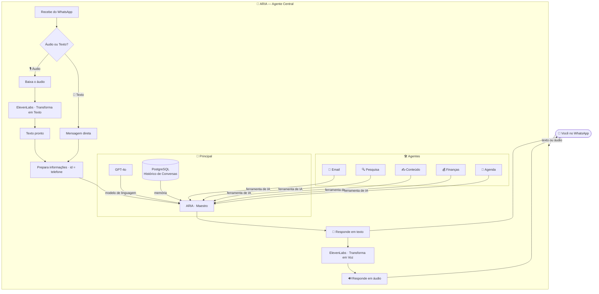
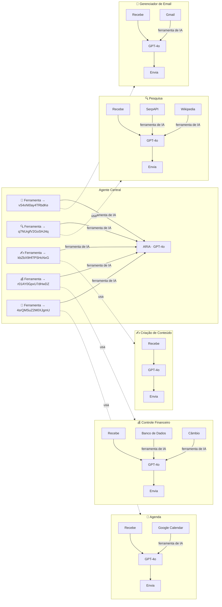
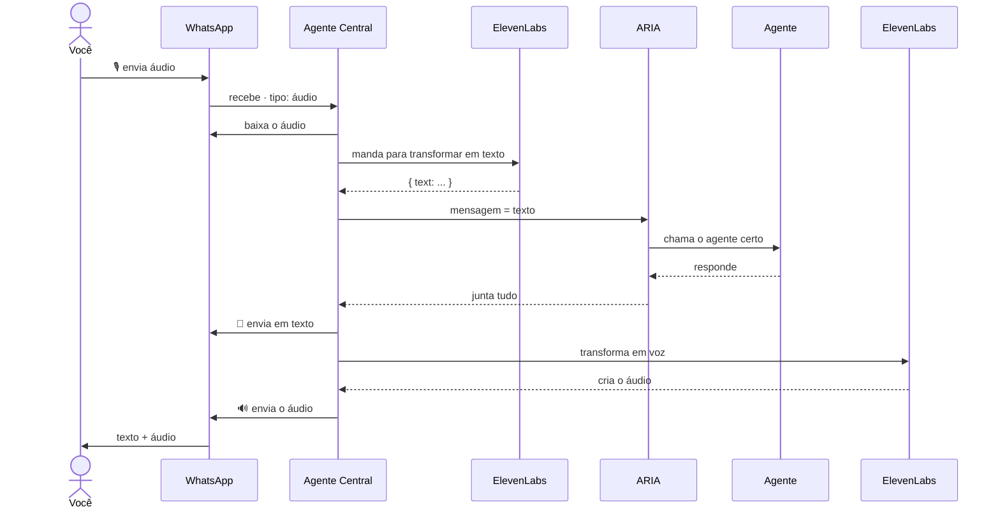

<div align="center">

<h1>ARIA — Sistema de Multi-Agentes de IA para WhatsApp</h1>

<p><strong>Cinco agentes de IA especializados. Um maestro. Um número de WhatsApp. Sem complicação.</strong></p>

<br>


<br><br>

> Criado por **Lucas Pontes Imeme** · 2026

</div>

---

## Resumo

ARIA é um sistema de IA com vários agentes, tudo dentro do WhatsApp.

Você manda uma mensagem (texto ou áudio), e um agente central feito com GPT-4o entende o que você precisa e chama o agente certo para ajudar, tudo automático.

**O que cada agente faz:**

| Agente | Função |
| --- | --- |
| 📧 Gerenciador de Email | Lida com emails no Gmail: lê, resume, prioriza e escreve |
| 🔍 Pesquisa | Busca na web, compara informações e resume |
| ✍️ Criação de Conteúdo | Produz posts, artigos e roteiros para várias plataformas |
| 💰 Controle Financeiro | Anota gastos, faz relatórios e converte moedas |
| 📅 Agenda | Cria eventos, consulta sua agenda e envia convites |

A memória é guardada no **PostgreSQL**. A entrada e saída são por voz, usando **ElevenLabs**. Tudo feito no **n8n, com fluxos de trabalho separados como ferramentas de IA** – sem precisar de código de programação.

---

## Funções

- 🧠 **Arquitetura com Vários Agentes**: agentes que fazem coisas específicas, coordenados por um agente central usando um modelo de linguagem grande (LLM).
- 🎙️ **Entrada e Saída por Voz**: transforma áudio em texto e responde com voz sintetizada.
- 💬 **WhatsApp como Interface**: use direto no WhatsApp, sem precisar aprender a usar outro app.
- 🗄️ **Memória que Guarda Informações**: salva o histórico no PostgreSQL, organizado por número de telefone.
- 🔧 **Organização Baseada em Ferramentas**: usa fluxos de trabalho como ferramentas de IA.
- 🔄 **Agentes Que Trabalham Juntos**: ARIA usa vários agentes um após o outro quando precisa.
- ✅ **Testado**: Tudo funcionando certinho, sem erros.

---

## Como Funciona

ARIA usa um sistema com vários agentes coordenados por um modelo de linguagem grande.

O processo é assim:

1. Você manda uma mensagem no WhatsApp (texto ou áudio).
2. Se for áudio, o ElevenLabs transforma em texto.
3. O agente central recebe o texto e sabe sobre o que você está falando.
4. O GPT-4o decide qual agente especializado deve te ajudar.
5. O agente faz o trabalho, usando ferramentas como Gmail, Google Calendar, etc.
6. Você recebe a resposta em texto e, se quiser, em áudio.



---

## Os Cinco Agentes

Cada agente tem seu próprio GPT-4o, instruções específicas, ferramentas e um jeito de pensar configurado para o que precisa fazer.

<br>

### 📧 Gerenciador de Email · `vS4xNI0ay4TRbdKe`

Lê e organiza seus emails, resume conversas longas, escreve respostas formais e arruma sua caixa de entrada.

<br>

### 🔍 Pesquisa · `q7NUrgfV2GoSHJ4q`

Faz buscas na internet, compara várias fontes, encontra informações diferentes e te dá um resumo com explicações claras.

<br>

### ✍️ Criação de Conteúdo · `kbZbX9Hf7PSHcNxG`

Cria posts para LinkedIn, Instagram, Twitter/X, blogs, etc. Sabe como escrever para cada lugar.

<br>

### 💰 Controle Financeiro · `r01AY0GpxU7dHwDZ`

Anota o que você ganha e gasta, organiza por categoria, mostra os preços das moedas e faz relatórios.

<br>

### 📅 Agenda · `4srQMSuZ2M0XJgmU`

Cria eventos, avisa se tem algum horário já ocupado, manda convites e calcula horários em outros lugares do mundo.

---

## Como os Agentes Se Conectam

Cada agente é um fluxo de trabalho separado. O agente central os encontra e usa como ferramentas de IA.

O agente central lê as descrições de cada agente e decide qual usar, sem precisar de regras complicadas.



> **Se você está começando a usar IA, é bom saber:** as setas estão ao contrário – o agente *pega* os recursos.

---

## Como Funciona a Voz



O ElevenLabs transforma áudios do WhatsApp em texto direitinho. A voz que ele usa para responder soa natural.

---

## Testes

Todos os processos foram testados antes de serem publicados.

| Processo | ID | Peças | Ligações | Erros |
| --- | --- | --- | --- | --- |
| 🤖 Agente Central | `JeUjU5XyZHOf5NpN` | 18 | 16 | **0** |
| 📧 Email | `vS4xNI0ay4TRbdKe` | 5 | 3 | **0** |
| 🔍 Pesquisa | `q7NUrgfV2GoSHJ4q` | 6 | 4 | **0** |
| ✍️ Conteúdo | `kbZbX9Hf7PSHcNxG` | 4 | 2 | **0** |
| 💰 Finanças | `r01AY0GpxU7dHwDZ` | 6 | 4 | **0** |
| 📅 Agenda | `4srQMSuZ2M0XJgmU` | 5 | 3 | **0** |

Os avisos que aparecem são só para avisar, não atrapalham o funcionamento.

---

## Quem Pode Usar

Este sistema foi feito para ajudar pessoas que precisam lidar com muitas coisas ao mesmo tempo e têm pouco tempo.

<br>

**Profissionais e Freelancers**

Quem trabalha sozinho faz vários trabalhos diferentes ao mesmo tempo: atender clientes, produzir, cuidar das finanças, organizar a agenda. ARIA te ajuda a fazer essas tarefas, para que você possa focar no que é mais importante.

<br>

**Equipes Pequenas e Startups**

Quando a equipe é pequena, cada pessoa tem muitas responsabilidades. ARIA pode ajudar todos a criar conteúdo, ver a agenda, fazer pesquisas e registrar gastos, sem depender de uma pessoa específica.

<br>

**Gerentes e Donos de Empresas**

Quem gerencia um negócio precisa tomar muitas decisões rápidas. ARIA te ajuda a escrever emails, registrar gastos, criar posts e checar a agenda, para que você não perca tempo com essas tarefas.

<br>

**Quem Quer Aprender a Usar IA**

Este sistema pode te ensinar a usar IA para automatizar tarefas. Ele mostra como usar fluxos de trabalho, guardar informações, usar voz e organizar tudo.

---

## Como Instalar

### O Que Você Precisa

```env
WHATSAPP_TOKEN=                              # Código da API do WhatsApp Business
WHATSAPP_PHONE_ID=                           # ID do número de telefone registrado
ELEVENLABS_API_KEY=                          # Código da API do ElevenLabs
ELEVENLABS_VOICE_ID=                         # ID da voz para responder (ex: 21m00Tcm4TlvDq8ikWAM)
N8N_COMMUNITY_PACKAGES_ALLOW_TOOL_USAGE=true # Para usar as ferramentas de IA
```

### Onde Colocar os Códigos

| Código | Onde Colocar |
| --- | --- |
| OpenAI API Key | Em todos os 6 processos |
| PostgreSQL | No processo `Postgres Memory` no agente central |
| Google OAuth2 | Nas ferramentas Gmail e Google Calendar |
| WhatsApp | No gatilho do WhatsApp e nas mensagens |

### Como Ligar

Você só precisa ligar o **Agente Central** (`JeUjU5XyZHOf5NpN`).

Os outros agentes são chamados pelo agente central e não precisam ser ligados. Depois de ligar o agente central, copie o endereço que ele criou e coloque no painel do Meta Developers.

---

## O Que Foi Usado

| | Ferramenta | Versão | O Que Faz |
| - | --- | --- | --- |
| ⚙️ | n8n | 2.35.6 | Liga todos os processos |
| 🧠 | OpenAI GPT-4o | mais nova | Modelo de linguagem para o agente central e os outros |
| 🎙️ | ElevenLabs Scribe v1 | — | Transforma áudio em texto |
| 🔊 | ElevenLabs Multilingual v2 | — | Transforma texto em voz |
| 📱 | WhatsApp Business Cloud API | v19.0 | Envia e recebe mensagens |
| 🗄️ | PostgreSQL | — | Guarda informações das conversas |
| 📧 | Gmail API | — | Lida com emails |
| 📅 | Google Calendar API | — | Lida com a agenda |
| 🌐 | SerpAPI | — | Faz pesquisas na internet |
| 💱 | Exchange Rate API | v4 | Mostra os preços das moedas |

---

## Exemplos de Uso

```
Me resume os emails de hoje que ainda não li, começando pelos mais importantes
→ O Gerenciador de Email encontra os emails e faz um resumo organizado

O que está acontecendo com a inteligência artificial no Brasil?
→ O agente de Pesquisa procura, compara informações e faz um resumo

Escreve um post para o LinkedIn sobre os perigos de usar automação sem pensar
→ O agente de Conteúdo cria o texto certo para o LinkedIn

Gastei R$ 240 no jantar de hoje, foi para conhecer clientes
→ O agente Financeiro anota o gasto

Marca uma reunião sexta às 10h com o pessoal do produto
→ O agente de Agenda cria o evento e manda os convites

Pesquisa quem são os concorrentes da [empresa] e faz um resumo
→ Os agentes de Pesquisa e Conteúdo trabalham juntos
```

---

## O Que Vem Por Aí

- [ ] Suporte para usar o Telegram
- [ ] Site para controlar tudo
- [ ] Agente para controlar clientes (CRM)
- [ ] Ligação com o Notion
- [ ] Guardar mais informações das conversas
- [ ] Agente para organizar tarefas com Asana/Trello
- [ ] Mostrar como as pessoas estão usando cada agente

---

## Mais Informações

- [Como tudo funciona](docs/architecture.md)
- [Como são os processos](docs/workflows.md)
- [Como funciona a voz](docs/voice.md)
- [Como instalar](docs/setup.md)

> *Estamos escrevendo a documentação. Se quiser ajudar, pode nos enviar suas ideias!*

---

<div align="center">

**© 2026 Lucas Pontes Imeme**

Pode usar para aprender e para uso pessoal.
Para usar para negócios, precisa pedir permissão.

[CC BY-NC 4.0](https://creativecommons.org/licenses/by-nc/4.0/)

</div>
