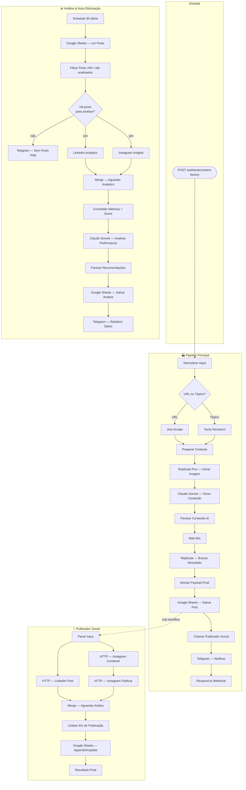

<div align="center">

<h1>Multi-Modal Content Factory</h1>

<p><strong>Três workflows que transformam um tópico ou URL em posts publicados, com imagem gerada por IA, análise de performance e auto-otimização de 7 dias.</strong></p>

<br>


<br><br>

> Feito por **Lucas Pontes Imeme** · 2026

</div>

---

## Resumo

Você manda um tópico ou uma URL. O **Pipeline Principal** pesquisa, escreve os textos para LinkedIn e Instagram, gera uma imagem profissional com Flux AI, publica em ambas as plataformas e te notifica no Telegram — tudo em menos de 2 minutos.

24 horas depois, o **Analisador** coleta as métricas reais das duas redes, calcula um score de engajamento, manda o resultado para o Claude avaliar e salva as instruções otimizadas no Google Sheets para o próximo post ser melhor.

O ciclo se repete sozinho por 7 dias.

| Workflow | O que faz |
|---|---|
| 🏭 Pipeline Principal | Recebe input → Pesquisa → Gera texto + imagem → Publica → Notifica |
| 📅 Publicador Social | Sub-workflow que executa a publicação no LinkedIn e Instagram |
| 📊 Análise & Auto-Otimização | Roda todo dia às 9h → Coleta métricas → Claude analisa → Salva instruções |

---

## O que ele faz

- 🔍 **Pesquisa real** — Usa Tavily para buscar contexto atualizado sobre o tópico, ou Jina para fazer scrape direto de uma URL
- ✍️ **Copywriting com IA** — Claude Sonnet gera post para LinkedIn (até 1300 chars) e caption para Instagram com stories e hashtags
- 🖼️ **Imagem gerada por Flux 1.1 Pro** — Foto profissional criada via Replicate, específica para o tópico e nicho
- 📤 **Publicação dupla** — LinkedIn via UGC API e Instagram via Meta Graph API, em paralelo com Merge node garantindo sincronização
- 📊 **Análise de performance real** — Coleta métricas das duas plataformas 24h após a publicação
- 🤖 **Auto-otimização** — Claude analisa os dados, identifica o problema principal e gera instruções para o próximo post
- 📋 **Google Sheets como memória** — Cada post, cada análise e cada instrução de melhoria ficam registrados
- 📲 **Notificações no Telegram** — Alerta ao publicar e relatório diário com score, insights e sugestão de tópico
- 🔄 **Retry automático** — `continueRegularOutput` em todas as chamadas HTTP garante que a falha de uma API não derruba o fluxo inteiro

---

## Como funciona



### Passo a passo do Pipeline Principal

```
POST /content-factory
  └─► Normalizar Input          # topic, url, tone, niche, brand_voice, session_id
        └─► IF — URL ou Tópico?
              ├─► [URL]    Jina Scrape          # https://r.jina.ai/{url}
              └─► [Tópico] Tavily Research      # search_depth: advanced, max_results: 5
                    └─► Preparar Contexto Pesquisa
                          └─► Replicate Flux — Iniciar    # POST /models/flux-1.1-pro/predictions
                                └─► Claude Sonnet — Gerar Conteúdo   # LinkedIn + Instagram + Stories
                                      └─► Parsear Conteúdo AI
                                            └─► Wait 90s
                                                  └─► Replicate — Buscar Resultado
                                                        └─► Montar Payload Final
                                                              └─► Google Sheets — Salvar Post
                                                                    └─► 📅 Publicador Social
                                                                          └─► Telegram + Respond
```

---

## Resultados dos testes

### Validação estrutural — perfil `runtime` (n8n-mcp)

| Workflow | ID | Nós | Conexões | Erros | Warnings |
|---|---|---|---|---|---|
| 🏭 Pipeline Principal | `VhLpQLmXc2iJBZDV` | 17 | 17 válidas | **0** | 20 (estilo) |
| 📅 Publicador Social | `4pp8vEUYgtkQRJ3U` | 9 | 9 válidas | **0** | 8 (estilo) |
| 📊 Análise & Auto-Otimização | `p9hUKbD68fxMPFkY` | 14 | 14 válidas | **0** | 18 (estilo) |

> Os warnings são cosméticos: formato do `chatId`, sugestões de `onError` em nós não-críticos e typeVersions. Nenhum afeta a execução.

### Bugs corrigidos durante o desenvolvimento

| # | Severidade | Problema | Correção aplicada |
|---|---|---|---|
| 1 | 🔴 Grave | `session_id` com expressão `=cf_{{$now.toMillis()}}` inválida | Corrigido para `={{'cf_' + $now.toMillis()}}` |
| 2 | 🔴 Grave | Telegram referenciava `$('Code - Montar Payload Final')` com hífen | Corrigido para travessão `—` conforme nome real do nó |
| 3 | 🔴 Grave | Replicate API recebia `"version": "slug"` → HTTP 422 | Endpoint correto: `/v1/models/{owner}/{name}/predictions` |
| 4 | 🔴 Race Condition | Publicador sem Merge node — coletor executava antes de ambas as APIs responderem | Adicionado `Merge — Aguardar LinkedIn e Instagram` |
| 5 | 🔴 Race Condition | Análise sem Merge node — métricas consolidadas antes de chegarem as duas | Adicionado `Merge — Aguardar Analytics` |
| 6 | 🟡 Importante | IF node sem `combinator: "and"` → falha no filtro de condições | Adicionado `combinator` + `typeValidation: "loose"` |
| 7 | 🟡 Importante | Schedule com `field: "hours"` não garantia execução às 9h fixas | Corrigido para `field: "days"` com `triggerAtHour: 9` |
| 8 | 🟡 Importante | `Respond to Webhook` montava JSON via string interpolation (quebrava com `null`) | Refatorado para `JSON.stringify()` seguro |
| 9 | 🟡 Importante | Wait de 50s insuficiente para Flux 1.1 Pro (pode levar até 120s) | Aumentado para 90s |
| 10 | 🟡 Importante | Google Sheets `update` sem `range` e `values` → erro de validação | Substituído por `appendOrUpdate` com `matchingColumns` |
| 11 | 🟡 Importante | `?.` (optional chaining) em expressões Telegram → não suportado pelo n8n | Substituído por `|| 0` e `|| 'N/A'` |
| 12 | 🟡 Melhoria | Google Sheets `read` sem campo `range` → erro de validação | Adicionado `range: "A:Z"` |

---

## Pré-requisitos

- n8n `>= 2.35.6` rodando localmente ou em produção
- Conta [Tavily](https://tavily.com) com API key (plano gratuito funciona)
- Conta [Replicate](https://replicate.com) com token (cobrança por uso do Flux)
- LinkedIn: OAuth App com permissão `w_member_social` ou acesso de organização
- Instagram: Meta App com permissão `instagram_content_publish`
- Bot do Telegram criado via [@BotFather](https://t.me/BotFather)
- Google Sheets com as abas `Posts` e `Analises` já criadas

---

## Instalação

### 1. Variáveis de ambiente

Configure em `Settings → Variables` no painel do n8n:

```env
TAVILY_API_KEY=             # tavily.com → API Keys
REPLICATE_API_TOKEN=        # replicate.com → Account Settings
LINKEDIN_ACCESS_TOKEN=      # OAuth token com w_member_social
LINKEDIN_ORG_ID=            # ID numérico da sua página de empresa
INSTAGRAM_USER_ID=          # ID do usuário na Meta Graph API
INSTAGRAM_ACCESS_TOKEN=     # Token de acesso Meta Graph API
TELEGRAM_CHAT_ID=           # Use @get_id_bot para descobrir
CONTENT_FACTORY_SHEET_ID=   # ID da planilha (da URL do Google Sheets)
```

### 2. Importar os workflows

Importe os três arquivos da pasta `workflows/` pelo painel do n8n (`Workflows → Import`):

```
content-factory/
├── workflows/
│   ├── pipeline_principal.json          # 🏭 ID: VhLpQLmXc2iJBZDV
│   ├── publicador_social.json           # 📅 ID: 4pp8vEUYgtkQRJ3U
│   └── analise_auto_otimizacao.json     # 📊 ID: p9hUKbD68fxMPFkY
└── README.md
```

### 3. Configurar a credencial Google

Adicione uma credencial Google OAuth2 nos nós `Google Sheets` dos três workflows.

### 4. Preparar o Google Sheets

Crie uma planilha com duas abas e as seguintes colunas:

**Aba `Posts`:**
```
session_id | topic | niche | tone | linkedin_text | instagram_caption |
instagram_stories | image_url | image_ready | meta_hook | predicted_score |
best_post_time | status | created_at | linkedin_post_id | instagram_post_id |
published_at | analyzed_at | actual_score | optimized_prompt_instructions
```

**Aba `Analises`:**
```
analyzed_at | performance_rating | score_real | engagement_score |
total_interactions | insights | top_problem | optimized_prompt_instructions |
best_posting_time | recommended_content_type | next_topic_suggestion |
linkedin_likes | linkedin_comments | linkedin_shares | instagram_likes | instagram_reach
```

### 5. Ativar o Analisador

Ative o **📊 Análise & Auto-Otimização** no painel. Ele passará a rodar todo dia às 9h automaticamente.

> ⚠️ O **📅 Publicador Social** não precisa ser ativado — ele é chamado como sub-workflow pelo Pipeline Principal.

---

## Como usar

**Disparar por tópico:**

```bash
curl -X POST https://seu-n8n.com/webhook/content-factory \
  -H "Content-Type: application/json" \
  -d '{
    "topic": "Como IA está transformando o recrutamento em 2026",
    "niche": "RH e tecnologia",
    "tone": "profissional e empático",
    "language": "pt-BR",
    "brand_voice": "inovadora e acessível"
  }'
```

**Disparar por URL:**

```bash
curl -X POST https://seu-n8n.com/webhook/content-factory \
  -H "Content-Type: application/json" \
  -d '{
    "url": "https://techcrunch.com/artigo-sobre-ia",
    "niche": "tecnologia",
    "tone": "direto e informativo"
  }'
```

**Resposta:**

```json
{
  "success": true,
  "session_id": "cf_1741564800000",
  "topic": "Como IA está transformando o recrutamento em 2026",
  "image_url": "https://replicate.delivery/pbxt/...",
  "predicted_score": 7.8,
  "message": "Conteudo gerado e publicado com sucesso! Analise de performance em 24h."
}
```

---

## Exemplos de notificações no Telegram

**Post publicado:**
```
Content Factory - Post Publicado!

Topico: Como IA está transformando o recrutamento em 2026
Nicho: RH e tecnologia
Score Previsto: 7.8/10
Imagem: Gerada com Flux AI

LinkedIn: Publicado
Instagram: Publicado

Analise de performance em 24h
ID: cf_1741564800000
```

**Relatório diário:**
```
Content Factory - Relatorio Diario

Data: 10/03/2026
Performance: BOM | Score: 7.2/10
Engajamento: 4.35%

LinkedIn: 48 curtidas | 12 comentarios | 7 shares
Instagram: 134 curtidas | 21200 alcance

Insights: Engajamento acima da média no LinkedIn, especialmente
em compartilhamentos. Instagram ficou abaixo do esperado.

Problema: Caption longa demais, perdendo atenção no feed.
Proximo topico: Ferramentas de automação de RH para PMEs
Melhor horario: 08:00
Formato ideal: carrossel
```

---

## Stack

| | Ferramenta | Versão | Papel |
|---|---|---|---|
| ⚙️ | n8n | 2.35.6+ | Orquestração dos três workflows |
| 🤖 | Claude Sonnet 4.6 | `claude-sonnet-4-20250514` | Geração de copy e análise de performance |
| 🖼️ | Flux 1.1 Pro | via Replicate | Geração de imagem profissional por IA |
| 🔍 | Tavily | API v1 | Pesquisa web com contexto atualizado |
| 🕷️ | Jina Reader | r.jina.ai | Scrape de URL em texto limpo |
| 📊 | Google Sheets | API v4 | Memória persistente de posts e análises |
| 📲 | Telegram Bot API | — | Notificações de publicação e relatório diário |
| 🔗 | LinkedIn UGC API | v2 | Publicação em página de empresa |
| 📸 | Meta Graph API | v18 | Publicação no Instagram Business |

---

## Roadmap

- [ ] Suporte a TikTok
- [ ] Geração de vídeo curto com Runway ML
- [ ] Agendamento para o melhor horário calculado pela IA
- [ ] Carrossel automático para LinkedIn e Instagram
- [ ] Integração com Notion como base de conhecimento da marca
- [ ] A/B test entre dois ângulos de copy no mesmo post
- [ ] Dashboard de performance em tempo real

---

<div align="center">

**© 2026 Lucas Pontes Imeme**

Pode usar para aprender.
Para uso comercial, precisa de autorização.

[CC BY-NC 4.0](https://creativecommons.org/licenses/by-nc/4.0/)

</div>
