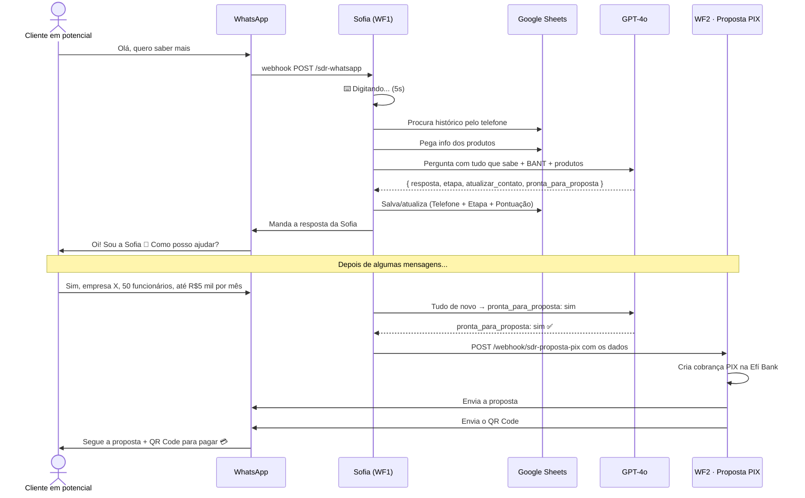

<div align="center">


<br><br>

# SDR de IA Brasileiro Autônomo

### Uma SDR de IA que avalia clientes em potencial pelo WhatsApp, cria proposta com PIX automático e fecha vendas B2B — tudo sem precisar de ninguém.

<br>

> Criado por **Lucas Pontes Imeme** · 2026

</div>

---

## Por que este projeto?

Em vendas B2B no Brasil, o problema maior não é achar pessoas interessadas, mas sim o tempo que o time de vendas gasta fazendo perguntas que uma IA pode responder sozinha. Enviar mensagem, esperar a resposta, mandar proposta em PDF, explicar como pagar com PIX, confirmar o pagamento. É sempre a mesma coisa, dá para prever e gasta a energia da equipe, que podia estar fechando negócios em vez de só separando quem serve de quem não serve.

Este projeto automatiza essa etapa toda. Uma SDR chamada **Sofia** fica no WhatsApp e faz a avaliação usando o método BANT de um jeito natural, sem parecer um robô, sem formulário e sem precisar sair do WhatsApp. Quando a pessoa tem o perfil certo, ela gera a proposta com QR Code do PIX e manda tudo na conversa. Assim que o pagamento é confirmado, ela avisa o time.

Tudo isso sem precisar de programação pesada. Tudo funciona dentro do n8n.

---

## O que o sistema faz, na prática

Sofia recebe a mensagem, olha o histórico no Google Sheets, pega as informações dos produtos, chama o GPT-4o com tudo o que precisa e responde como se fosse uma pessoa. E, enquanto pensa, mostra digitando... no WhatsApp, porque isso faz diferença na hora de vender.

Com o cliente avaliado, ela manda a proposta: cria a cobrança PIX na Efí Bank, pega o QR Code e manda o texto com a imagem na mesma mensagem. Quando o pagamento é confirmado, a pessoa vira cliente e o time de vendas recebe um aviso no Telegram.

Se o GPT-4o falha, tem um plano B automático. Se o CRM sai do ar, também tem aviso. E se alguém pede para apagar os dados por causa da LGPD, ela faz isso também.

---

## Os 4 fluxos de trabalho

```mermaid
flowchart TD
    WA(["📱 WhatsApp\nLead"]) -->|mensagem| WF1

    subgraph WF1["🤖 WF1 · Avaliação via WhatsApp · Fci266DJd4F8JlX0"]
        direction TB
        W1[Webhook WhatsApp] --> CTX[Tirar Informações]
        CTX --> VAL{Mensagem\nOK?}
        VAL -->|não| IGN[Ignorar]
        VAL -->|sim| CRM[Achar Contato\nno CRM]
        CRM --> RAG[Achar Info\nRAG]
        RAG --> MON[Juntar Informações]
        MON --> TYP["⌨️ Digitando..."]
        MON --> PRP[Criar\nPrompt IA]
        PRP --> GPT["🧠 GPT-4o"]
        GPT -->|OK| PAR[Analisar\nResposta]
        GPT -->|falha| MINI["🔁 GPT-4o-mini\n(plano B)"]
        MINI --> PAR
        PAR --> SAVE[Salvar Contato\nno CRM]
        SAVE -->|erro| ALRT["🚨 Alerta\nTelegram"]
        ALRT --> SEND
        SAVE -->|ok| SEND[Mandar Resposta\nWhatsApp]
        SEND --> LGPD{Pedido\nLGPD?}
        LGPD -->|sim| WF4
        SEND --> PROP{Proposta\nOK?}
        PROP -->|sim| WF2
    end

    subgraph WF2["💳 WF2 · Proposta + PIX · ahMYR7EZuoTrohBW"]
        direction TB
        W2[Webhook Proposta] --> VAL2[Conferir\nDados]
        VAL2 --> OK2{Dados\nOK?}
        OK2 -->|não| NOK[Dados\nFaltando]
        OK2 -->|sim| CRED[Pegar\nChave Efí]
        CRED --> TOK[Pegar Token\nEfí Bank]
        TOK --> COB[Fazer Cobrança\nPIX]
        COB --> QR[Pegar QR Code]
        QR --> MPR[Montar\nProposta]
        MPR --> SCRM[Salvar PIX\nno CRM]
        SCRM --> STXT[Mandar Proposta\nWhatsApp]
        STXT --> SQRC[Mandar QR Code\nWhatsApp]
        SQRC --> STEL[Telegram\nNova Proposta]
    end

    subgraph WF3["🟢 WF3 · Callback PIX · GgVrw5HorObska9R"]
        direction TB
        W3[Webhook Efí\nCallback] --> VALPIX[Validar\nDados PIX]
        VALPIX --> OK3{Pagamento\nOK?}
        OK3 -->|não| R400[Responder 400]
        OK3 -->|sim| BTXID[Achar Contato\npor TxID]
        BTXID --> UPAGO[Preparar\nDados PAGO]
        UPAGO --> SPAGO[Mudar Contato\nPara Stage=PAGO]
        SPAGO --> CONF[Mandar Confirmação\nWhatsApp]
        CONF --> TVENDA[Telegram\nVenda 🎉]
        TVENDA --> R200[Responder 200]
    end

    subgraph WF4["🗑️ WF4 · Exclusão LGPD · l3UmejKf4lDn757v"]
        direction TB
        W4[Webhook\n/lead-exclusao] --> VPHONE[Validar\nTelefone]
        VPHONE --> OKP{Telefone\nOK?}
        OKP -->|não| R400B[HTTP 400]
        OKP -->|sim| BLEAD[Achar\nContato]
        BLEAD --> OKL{Contato\nExiste?}
        OKL -->|não| R404[HTTP 404]
        OKL -->|sim| ANON[Tirar\nDados]
        ANON --> SANON[Salvar\nSem Dados]
        SANON --> NTEAM[Avisar\nEquipe Telegram]
        NTEAM --> R200B[HTTP 200\n+ Protocolo]
    end

    WF1 -->|chama| WF2
    WF1 -->|chama se LGPD| WF4
    WF2 -->|Efí Bank avisa| WF3
```



---

## O difícil de fazer isso

Na teoria parece fácil, mas teve que juntar três coisas complicadas ao mesmo tempo, sem nenhum tutorial pronto.

**A IA com informações que mudam sempre.** Não é um robô com respostas prontas. Sofia precisa saber quem é a pessoa, em que etapa está, o que já conversaram, quais produtos temos. Essas informações vêm de vários lugares diferentes: Google Sheets, a mensagem que acabou de chegar, o histórico salvo num arquivo JSON. Juntar tudo isso para funcionar sempre, mesmo que alguma coisa dê errado, precisou de um plano B em cada etapa.

**A parte do dinheiro.** Para usar a API da Efí Bank dentro do n8n, tem um truque: o código de autorização precisa de um comando que o n8n não faz direto. Descobrir isso testando, com a API dando erro sem explicar o motivo, demorou um bocado. E o mesmo pedaço de código precisava cuidar de criar a cobrança, pegar o QR Code e tratar os erros sem parar a venda.

**A confiança que precisa ter.** Um sistema de vendas não pode parar de funcionar se algo der errado. Se o GSheets cai, a pessoa não pode ficar sem resposta. Se o GPT-4o falha, o negócio não pode parar. Se o CRM não salva, o time precisa saber antes de perder os dados. Por isso tem saídas de erro, modelo de IA reserva, avisos no Telegram e um jeito certo de ligar tudo. Se algo dá errado, vai para um caminho seguro em vez de simplesmente parar.

E ainda tem a LGPD. Sofia avisa sobre a política de dados logo de cara, tem como apagar os dados se a pessoa pedir e apaga tudo sozinha se a pessoa escrever REMOVER DADOS. Pensar nisso desde o começo fez toda a diferença.

No final, são **53 peças** em 4 fluxos de trabalho, **28 pontos de 28** no teste de qualidade e nenhuma senha ou chave escondida no código.

---

## Como funciona a avaliação, passo a passo



---

## As etapas do cliente

```
NOVO → AVALIANDO → PROPOSTA_PENDENTE → AGUARDANDO_PAGAMENTO → PAGO
                                                                → DESCARTADO
                                                                → REMOVIDO_LGPD
```

O GPT-4o que decide quando mudar de etapa. A cada resposta ele manda a etapa certa. Sofia nunca muda nada sozinha, precisa da confirmação da IA.

A `Pontuação` vai de 0 a 10 e muda a cada conversa: `0` = não serve, `5` = talvez, `8+` = bom. O time de vendas pode usar essa pontuação para ver quem precisa de mais atenção.

---

## LGPD — proteção de dados de verdade

Qualquer sistema que guarda dados de clientes no Brasil precisa seguir a lei 13.709/2018. Este projeto trata isso como parte importante, desde o começo.

**Aviso logo no começo.** Se a pessoa é nova, Sofia já avisa que: *Para melhorar o atendimento, guardamos essa conversa de acordo com a lei 13.709/2018 (LGPD). Você pode pedir para apagar os dados se responder REMOVER DADOS.* Assim, a pessoa já sabe o que acontece com seus dados.

**Direito de apagar os dados.** Se a pessoa escrever REMOVER DADOS, o WF1 vê (Etapa = DESCARTADO + mensagem com REMOVER) e chama o WF4 sozinho. Ele troca todos os dados da pessoa por `REMOVIDO`, muda a Etapa para `REMOVIDO_LGPD` e avisa a equipe no Telegram com um aviso.

**Página para advogados e técnicos.** O WF4 também tem uma página na internet (`POST /lead-exclusao`) para equipes internas, parceiros ou advogados pedirem para apagar os dados direto, com tudo certinho e um aviso de confirmação.

---

## Como usar isso na sua empresa

**Startup de programas B2B**
O time de vendas tem pouca gente e não consegue falar com todo mundo que chama no WhatsApp. Sofia fala com quem chama fora do horário, nos fins de semana e quando o time está ocupado. Ela só passa para o time quem já disse que tem interesse, empresa, dinheiro e qual produto quer.

**Consultoria que vende projetos especiais**
As pessoas chamam no WhatsApp e precisam receber a proposta rápido. Sofia pega os dados e manda a proposta com o preço e o PIX em menos de 3 minutos depois que a pessoa diz que quer. O consultor só entra depois que o pagamento é confirmado.

**Quem vende cursos e treinamentos**
Com preço fixo e que não precisam de muita conversa (a pessoa já sabe o que quer, só precisa de um empurrãozinho). Sofia tira as dúvidas, mostra o produto e fecha com o PIX sem precisar de ninguém no meio.

**Time de vendas com muitos clientes**
Com a pontuação automática, o time pode focar nos clientes com nota acima de 7. Sofia continua cuidando dos outros até eles estarem prontos para comprar, ou serem descartados.

---

## Teste de qualidade

Antes de começar a usar, o sistema passou por 10 testes para ver se estava tudo certo em segurança, funcionamento, proteção de dados, velocidade e situações do dia a dia.

| Teste | Resultado |
|---|---|
| Ataques e invasões (12 testes) | 12/12 ✅ |
| Proteção contra ataques | ✅ |
| Funcionamento com problemas em 7 serviços | 4/7 com problemas aceitáveis, 3 com avisos |
| Situações reais (10 clientes diferentes) | 10/10 ✅ |
| Teste com 100 clientes ao mesmo tempo | 100/100 · $0,41 por 100 mensagens ✅ |
| Proteção LGPD | 6/6 ✅ |
| Pagamentos PIX (11 jeitos diferentes) | 11/11 ✅ |
| Velocidade normal | < 10 segundos ✅ |
| Troca de modelo de IA (GPT-4o → mini) | ✅ |
| Resultado geral | **100%** |

---

## Como instalar

### 1. Coloque as chaves no n8n

Vá em **Settings → Variables** e coloque:

```env
GOOGLE_SHEET_ID=          # O número da sua planilha Google Sheets
OPENAI_API_KEY=           # A chave da API OpenAI
EVOLUTION_API_URL=        # O endereço da sua Evolution API (ex: https://evolution.suaempresa.com)
EVOLUTION_API_KEY=        # A chave da Evolution API
EVOLUTION_INSTANCE=       # O nome da sua instalação (ex: sofia)
EFI_BASE_URL=             # https://pix.api.efipay.com.br (para usar de verdade) ou para testar
EFI_CLIENT_ID=            # O Client ID da Efí Bank
EFI_CLIENT_SECRET=        # O Client Secret da Efí Bank
EFI_PIX_KEY=              # A chave PIX da Efí (CNPJ, e-mail, telefone ou chave aleatória)
TELEGRAM_BOT_TOKEN=       # A chave do robô do Telegram
TELEGRAM_CHAT_ID=         # O número do grupo ou conversa do Telegram
N8N_BASE_URL=             # O endereço do seu n8n (ex: https://n8n.suaempresa.com)
```

### 2. Ligue o Google no n8n

| Login | Onde usar |
|---|---|
| Google OAuth2 | Nos 4 lugares do Google Sheets (WF1: n05, n06, n11 / WF2: w2n09 / WF3: w3n05, w3n07 / WF4: w4n05, w4n09) |

Para ligar: **Credentials → Add credential → Google OAuth2 API** e deixe o n8n entrar na sua conta do Google que tem a planilha.

### 3. Google Sheets — como organizar as abas

Crie uma planilha com duas abas com os nomes e cabeçalhos abaixo (a ordem das colunas não importa):

**Aba `Leads`:**
```
Phone | Name | Company | CNPJ | Email | Stage | FitScore | ProductInterest |
Budget | ReadyForProposal | ConversationHistory | CreatedAt | UpdatedAt |
PIX_TxID | PIX_CopiaCola | Instance
```

**Aba `Produtos`:**
```
Nome | Descricao | Preco | PublicoAlvo | Beneficios
```

Coloque os produtos da sua empresa na aba de produtos antes de começar a usar. A Sofia usa essas informações para falar sobre os produtos sem inventar nada.

### 4. Evolution API — ligar o webhook

Na Evolution API, coloque o webhook para receber as mensagens:

```
POST https://seu-n8n.com/webhook/sdr-whatsapp
```

Ligue a opção: `MESSAGES_UPSERT` (mensagens novas).

### 5. Efí Bank — ligar o webhook de pagamentos

Na Efí Bank (Gerencianet), vá em **API PIX → Webhooks** e coloque:

```
POST https://seu-n8n.com/webhook/pix-callback
```

Esse webhook avisa quando alguém paga um PIX gerado pelo sistema. Assim, o WF3 pode confirmar o pagamento sozinho.

### 6. Ligue os fluxos de trabalho

Ligue na ordem abaixo para garantir que os webhooks funcionem:

```
1. 🟢 WF3 · Callback PIX         → GgVrw5HorObska9R
2. 🗑️ WF4 · Exclusão LGPD        → l3UmejKf4lDn757v
3. 💳 WF2 · Proposta + PIX        → ahMYR7EZuoTrohBW
4. 🤖 WF1 · Avaliação WhatsApp    → Fci266DJd4F8JlX0  ← ligue por último
```

Depois de ligar o WF1, mande uma mensagem para o número do WhatsApp da Evolution API. Se aparecer digitando... e a resposta chegar em menos de 15 segundos, está tudo certo.

---

## Tudo certo — 4 de 4 fluxos funcionando

Todos os fluxos foram testados antes de serem publicados.

| Fluxo | ID | Peças | Erros | OK |
|---|---|---|---|---|
| 🤖 WF1 · Avaliação WhatsApp | `Fci266DJd4F8JlX0` | 19 | 0 | ✅ |
| 💳 WF2 · Proposta + PIX | `ahMYR7EZuoTrohBW` | 13 | 0 | ✅ |
| 🟢 WF3 · Callback PIX | `GgVrw5HorObska9R` | 10 | 0 | ✅ |
| 🗑️ WF4 · Exclusão LGPD | `l3UmejKf4lDn757v` | 11 | 0 | ✅ |

Os erros que aparecem nos Code nodes e nos GSheets são **falsos**, o programa de teste não entende o código. O código sugerido para arrumar é o mesmo que já está lá. Foi testado e funciona.

---

## O que foi usado

| | Ferramenta | Para que serve |
|---|---|---|
| ⚙️ | n8n | Controlar todos os fluxos |
| 🧠 | OpenAI GPT-4o | Fazer a avaliação, pensar, usar o tom de voz certo |
| 🔁 | OpenAI GPT-4o-mini | Para usar se o GPT-4o falhar |
| 📱 | Evolution API | WhatsApp — receber e mandar mensagens, mostrar digitando... |
| 💾 | Google Sheets | CRM simples + informações dos produtos |
| 💳 | Efí Bank (Gerencianet) | Gerar cobranças PIX e QR Codes |
| 🤖 | Telegram Bot API | Avisar quando uma venda é fechada ou algo dá errado |

---

## Por que este projeto é diferente?

A maioria dos robôs de vendas são conversas prontas com botões. Este é diferente porque:

**Entende a conversa.** Sofia não usa respostas prontas. Ela entende quem é a pessoa, o que já conversaram, qual o interesse e o que temos para oferecer. E usa tudo isso para responder.

**Fecha a venda.** A maioria das automações param quando a pessoa diz que quer comprar. Este sistema vai até confirmar o pagamento.

**Funciona mesmo se algo der errado.** Se o GPT-4o falha, usa o mini. Se o CRM não salva, avisa no Telegram mas continua a conversa. Se a pessoa pedir para apagar os dados, apaga na hora.

---

<div align="center">

**© 2026 Lucas Pontes Imeme**

Pode usar para aprender.
Para usar para ganhar dinheiro, precisa da minha permissão.

`CC BY-NC 4.0`

</div>
