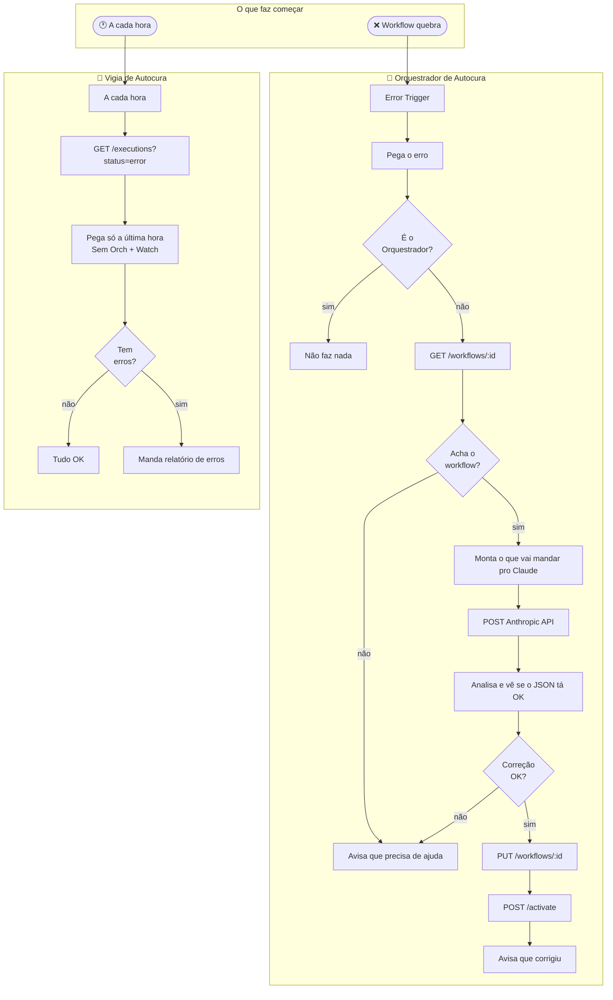
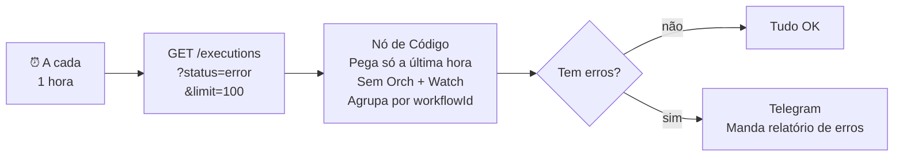
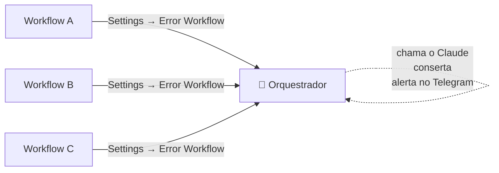

<div align="center">

<h1>Meta-Workflow de Autocura</h1>

<p><strong>Dois workflows que ficam de olho em tudo, encontram os problemas e resolvem — com a ajuda do Claude.</strong></p>

<br>


<br><br>

> Feito por **Lucas Pontes Imeme** · 2026

</div>

---

## Resumo

Se um workflow quebra no n8n, o **Orquestrador de Autocura** entra em ação: pega o código do workflow com erro, pede pro Claude achar o problema, pega o código corrigido, coloca no lugar e liga o workflow de novo — tudo sozinho.

Ao mesmo tempo, o **Vigia de Autocura** roda a cada hora, vê se tem algum erro que escapou e te avisa no Telegram.

| Workflow | O que faz |
|---|---|
| 🔧 Orquestrador de Autocura | Vê o erro → chama o Claude → conserta → religa |
| 📡 Vigia de Autocura | Checa tudo a cada hora → avisa se tem erros |

Você só precisa se preocupar quando a IA não consegue resolver sozinha.

---

## O que ele faz

- 🤖 **IA que corrige tudo** — O Claude Sonnet lê o código do workflow, entende o erro e manda uma versão corrigida
- 🔁 **Coloca no ar sozinho** — A correção é publicada usando a API do n8n, sem precisar fazer nada na mão
- 🛡️ **Não entra em looping** — O Orquestrador sabe se o erro veio dele mesmo e ignora
- 🔍 **Confere se a correção faz sentido** — O código que o Claude manda passa por uma checagem antes de ser usado (vê se tem `nodes`, `connections`, etc.)
- 📡 **Vigia que trabalha de hora em hora** — Manda um resumo de todos os workflows com erro na última hora
- 📲 **Avisos no Telegram** — Avisa quando a autocorreção funciona ou quando precisa de ajuda
- 🔄 **Tenta de novo se falhar** — Se a chamada HTTP falhar, tenta até 3 vezes
- ✅ **Testado com 27 casos** — Testamos tudo: resposta vazia, código JSON errado, texto com erros, problema de acesso, limite de uso, looping, etc.

---

## Como funciona

O sistema tem dois workflows separados, cada um com sua função.

O **Orquestrador** age quando acontece um erro, usando o `Error Trigger`. O **Vigia** age por conta própria, a cada hora, e checa se tem execuções com `error`.



---

## Detalhes do Orquestrador

### Passo a passo

**1. Error Trigger**
É o começo. Se um workflow tem `Error Workflow → 🔧 Self-Healing Orchestrator`, ele chama esse nó quando dá erro. Ele manda tudo: `workflow.id`, `workflow.name`, `execution.id`, `error.message`, `error.node`.

**2. Extract Error Context**
Organiza as informações do Error Trigger. Coloca a hora do erro (`errorTimestamp`) e, se não tiver o nome do nó com erro, coloca unknown.

**3. Is Self-Healing Loop?**
Para não entrar em looping. Vê se o `workflowId` é o mesmo do Orquestrador (`NKSnUIomh70jdb7g`). Se for, para. Se não, continua.

**4. Get Failed Workflow**
`GET http://localhost:5678/api/v1/workflows/:id` com header `X-N8N-API-KEY`. Tenta 3 vezes, com 2 segundos de espera. Se der erro (404 ou 500), continua para o próximo nó.

**5. Is Workflow Valid?**
Vê se `$json.nodes` existe. Se não existir (ex: workflow apagado), avisa que precisa de ajuda, sem mandar o erro pro Claude.

**6. Prepare Claude Prompt**
Prepara o texto com as informações: nome do workflow, nó com erro, mensagem de erro, hora e o código JSON do workflow. Pede pro Claude mandar só o JSON corrigido, com `name`, `nodes` e `connections`.

**7. Claude Analyzes and Fixes**
`POST https://api.anthropic.com/v1/messages` com modelo `claude-sonnet-4-6`, `max_tokens: 8096`. Headers: `x-api-key`, `anthropic-version: 2023-06-01`. Tenta 2 vezes, com 3 segundos de espera. Se a API falhar, continua para o próximo nó.

**8. Parse Claude Fix** *(Nó de Código — o mais importante)*
- Vê se a resposta da API Anthropic (`content[0].text`) está OK
- Tenta `JSON.parse()` direto; se não der, tenta pegar com regex `/{[\s\S]*}/`
- Vê se o resultado é `object` (não `null`, não `Array`)
- Vê se `nodes` é Array e `connections` é object
- Pega o `healingNote` do JSON antes de apagar
- Coloca o `name` se não tiver
- Manda `parseSuccess: boolean` + informações para os próximos nós

**9. Fix Valid?**
Checa se `parseSuccess === true`. Se sim, deploy. Se não, avisa que precisa de ajuda com o `healingNote`.

**10. Deploy Fixed Workflow**
`PUT /api/v1/workflows/:id` com o JSON corrigido. Tenta 3 vezes. O `workflowId` vem do Parse Claude Fix, pra manter a informação original.

**11. Reactivate Workflow**
`POST /api/v1/workflows/:id/activate`. Pega o `workflowId` do `$('Parse Claude Fix').first().json`.

**12/13. Notify Fix Success / Notify Manual Fix Needed**
Dois nós do Telegram com textos diferentes. O de sucesso mostra o que o Claude falou (`healingNote`), o nome do workflow e a hora. O de falha usa `||` para pegar as informações, já que pode vir de dois lugares diferentes.

---

## Detalhes do Vigia



O nó de Código do Vigia faz 4 coisas:

1. **Pega só a última hora** — Vê se a hora de cada execução (`startedAt`) é menor que `Date.now() - 3600000`.

2. **Tira os workflows do sistema** — Ignora os erros do Orquestrador e do Vigia.

3. **Agrupa por workflow** — Se um workflow quebrou 15 vezes, mostra `1 workflow · 15 falhas`, em vez de 15 linhas.

4. **Formata o relatório** — Mostra em português, conta os erros, conta os workflows e mostra a hora do último erro.

---

## Testes

Os dois workflows passaram por testes:

**Teste 1 — validador n8n-mcp (perfil `strict`)**

| Workflow | ID | Nós | Conexões | Erros |
|---|---|---|---|---|
| 🔧 Orquestrador de Autocura | `NKSnUIomh70jdb7g` | 14 | 11 | **0** |
| 📡 Vigia de Autocura | `FD0OCHSatdMzYc2I` | 6 | 5 | **0** |

**Teste 2 — testes em Node.js (27 casos)**

| O que foi testado | Resultados | Resultado |
|---|---|---|
| API Anthropic com erro | undefined, null, sem texto | ✅ 4/4 |
| Código JSON do Claude com erro | null, array, sem `nodes`, sem `connections` | ✅ 4/4 |
| JSON OK com variações | direto, dentro de texto, com `healingNote` | ✅ 3/3 |
| Erros de API (401, limite de uso) | erro com estrutura diferente | ✅ 2/2 |
| Vigia — filtro | Orquestrador, Vigia, execuções antigas | ✅ 3/3 |
| Vigia — vê os erros | erro recente, misturado, sem `startedAt`, `workflowData: null` | ✅ 4/4 |
| Vigia — muitos erros | 100 erros no mesmo workflow | ✅ 1/1 |
| Vigia — informações erradas | undefined, null, string | ✅ 3/3 |
| Avisos de ajuda | erro 404 vs erro de análise | ✅ 2/2 |

Os avisos que sobraram não atrapalham:
- `chatId` sem resource locator format — só um detalhe de estilo
- Nó de Código sem try/catch — a lógica interna já cuida de tudo
- Corrente longa de nós — só um aviso, não é um bug

---

## Bugs corrigidos

Este projeto foi revisado várias vezes. Veja a lista de bugs corrigidos:

| # | Problema | Bug | Correção |
|---|---|---|---|
| 1 | 🔴 Grave | `.item.json` errado em nós de Código (v2) | Troquei por `.first().json` |
| 2 | 🔴 Grave | `$now.minus(1, 'hour')` — erro, não funcionava | Troquei por `Date.now() - 3600000` |
| 3 | 🔴 Grave | `response.content[0].text` sem proteção — dava erro | Checagem: `content && Array.isArray && length > 0 && .text` |
| 4 | 🔴 Grave | `JSON.parse()` podia retornar `null` → `parseSuccess = true` mas `fixedWorkflow.nodes` dava erro | Só aceita `object` não-nulo |
| 5 | 🟡 Importante | Sem checar depois do GET — mandava o erro 404 pro Claude | Novo nó checa `$json.nodes` |
| 6 | 🟡 Importante | Sem proteção contra looping | Bloqueia `workflowId === NKSnUIomh70jdb7g` |
| 7 | 🟡 Importante | Deploy sem `name` — a API do n8n precisa | Nó de Código coloca `fixedWorkflow.name = workflowName` |
| 8 | 🟡 Importante | Sem checar o JSON do Claude | Checa se `nodes` é Array e `connections` é object |
| 9 | 🟡 Importante | `filter()` com erros | Reescrevi com `forEach + push` |
| 10 | 🟡 Bom | Sem `responseFormat: json` nos nós HTTP | Coloquei em todos |
| 11 | 🟡 Bom | Sem `waitBetweenTries` nas tentativas | Coloquei 2000ms de espera |
| 12 | 🟡 Bom | Vigia mostrava todos os erros antigos | Filtro de 1 hora |
| 13 | 🔴 Lógico | `healingNote` era apagado | Checa a variável local |
| 14 | 🔴 Funcionamento | `Notify Manual Fix Needed` mostrava `undefined` | Usei `||` para pegar as informações |

---

## Como instalar

### O que precisa

- n8n rodando com API ligada (Settings → API → Enable)
- Bot do Telegram criado via [@BotFather](https://t.me/BotFather)
- Chave da API da Anthropic com acesso ao `claude-sonnet-4-6`

### Variáveis

```env
N8N_API_KEY=          # Em Settings → API do n8n
ANTHROPIC_API_KEY=    # Em console.anthropic.com
TELEGRAM_CHAT_ID=     # Use @get_id_bot
```

### Credenciais

| Credencial | Onde usar | Como configurar |
|---|---|---|
| Telegram Bot | `Notify Fix Success`, `Notify Manual Fix Needed`, `Send Error Report` | Coloque o token do bot |

### Como ligar

**1. Coloque as variáveis** em Settings → Environment Variables.

**2. Coloque a credencial do Telegram** nos três nós que mandam mensagem.

**3. Ligue o Vigia** no painel do n8n. Ele vai rodar a cada hora.

**4. Não ligue o Orquestrador** — ele liga sozinho quando um workflow dá erro.

**5. Conecte os workflows** — Em cada workflow, vá em Settings → Error Workflow → `🔧 Self-Healing Orchestrator`.



---

## Como o Claude conserta

O que vai pro Claude:

- Nome do workflow e ID do erro
- Nome do nó com erro
- Mensagem de erro
- Hora do erro
- Código JSON do workflow

O que pedimos pro Claude:
1. Achar a causa do erro
2. Achar o nó ou a expressão com problema
3. Mandar **só** o JSON corrigido — sem texto, sem explicação
4. Se não conseguir, mandar o JSON original com um `healingNote`

Se vier com texto, usamos `/{[\s\S]*}/` para pegar o JSON. Se tiver `healingNote`, mostramos no Telegram.

---

## Exemplos de mensagens

**Corrigiu sozinho:**

```
✅ AUTOCURA OK

Workflow: 🤖 ARIA — Orquestrador Principal
Erro: Cannot read properties of undefined (reading 'id')
Nó: Extract Session ID
O Claude falou: Corrigido acesso a $json.message.from.id com optional chaining e fallback para string vazia
Hora: 2026-03-07T14:32:10.000Z

Workflow corrigido.
```

**Precisa de ajuda:**

```
⚠️ AJUDA NECESSÁRIA

Workflow: Finance Tracker
Erro: Request failed with status code 503
Nó: Finance DB Webhook
Hora: 2026-03-07T15:01:44.000Z

O Claude falou: Workflow não encontrado.

Acesse o n8n para corrigir.
```

**Relatório do Vigia:**

```
📡 RELATÓRIO DO VIGIA — 07/03/2026, 15:00:00

3 erro(s) em 2 workflow(s):

ERRO: ARIA — Orquestrador Principal - 2 vez(es) | Último: 07/03/2026, 14:47:22
ERRO: Finance Tracker - 1 vez(es) | Último: 07/03/2026, 14:58:01
```

---

## O que ele resolve e o que não resolve

**Resolve sozinho:**
- Erros de expressão (`$json.campo.inexistente`)
- Configurações erradas (método HTTP errado, URL errada)
- Informações faltando
- Lógica de IF errada

**Precisa de ajuda:**
- Credenciais erradas
- Workflow apagado
- Erros de serviços externos
- Mudanças em APIs

---

## O que usamos

| | Ferramenta | Versão | O que faz |
|---|---|---|---|
| ⚙️ | n8n | 2.35.6 | Roda os workflows |
| 🤖 | Claude Sonnet 4.6 | claude-sonnet-4-6 | Acha os erros e conserta |
| 📲 | Telegram Bot API | — | Manda os alertas |
| 🔌 | n8n REST API | v1 | Pega/Coloca/Envia informações |

---

## Como está organizado

```
self-healing-watchdog/
├── workflows/
│   ├── self_healing_orchestrator.json   # 🔧 Orquestrador — ID: NKSnUIomh70jdb7g
│   └── self_healing_watchdog.json       # 📡 Vigia — ID: FD0OCHSatdMzYc2I
└── README.md
```

---

## O que vem por aí

- [ ] Histórico das correções
- [ ] Painel com informações da saúde do sistema
- [ ] Suporte para mais de um n8n
- [ ] Avisos no Discord e Slack
- [ ] Checar se a correção é boa antes de usar
- [ ] Desfazer se o workflow quebrar de novo em 5 minutos
- [ ] Testar antes de colocar no ar

---

<div align="center">

**© 2026 Lucas Pontes Imeme**

Pode usar para aprender.
Para uso comercial, precisa de autorização.

[CC BY-NC 4.0](https://creativecommons.org/licenses/by-nc/4.0/)

</div>
